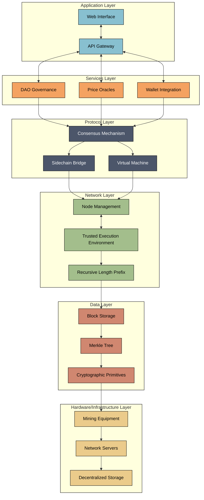

# Vintara - Native Bitcoin DeFi Protocol on Rootstock

> **One-sentence description**: A comprehensive DeFi protocol that enables users to earn native Bitcoin yield through automated lending, liquidity provision, and yield farming strategies on Rootstock.

## Project Overview

Vintara is a revolutionary DeFi protocol built on Rootstock (RSK), Bitcoin's longest-running and most secure sidechain. Our protocol enables users to earn native Bitcoin yield through multiple strategies while leveraging Bitcoin's unmatched security and stability.

### Key Features

- **Native Bitcoin Yield**: Earn yield directly in Bitcoin (rBTC) through our automated strategies
- **Collateralized Lending**: Borrow against rBTC collateral with dynamic interest rates
- **Liquidity Pools**: Provide liquidity to earn trading fees and rewards
- **Yield Farming**: Stake LP tokens to earn additional VINT token rewards
- **DAO Governance**: Community-driven protocol governance with VINT token voting
- **Bitcoin Security**: Protected by Bitcoin's hash power through Rootstock's merged mining

## Architecture



### Smart Contracts

Our protocol consists of 6 core smart contracts deployed on Rootstock:

1. **YieldVault.sol** - Main vault for deposit/withdraw operations with automated yield generation
2. **LendingProtocol.sol** - Collateralized lending system with dynamic interest rates
3. **LiquidityPool.sol** - AMM with yield generation and fee collection
4. **YieldFarming.sol** - Staking rewards and farming mechanisms
5. **PriceOracle.sol** - Price feeds integration with fallback mechanisms
6. **Governance.sol** - DAO governance for protocol parameters

### Technology Stack

- **Blockchain**: Rootstock (RSK) Testnet
- **Smart Contracts**: Solidity 0.8.19+
- **Development**: Hardhat, OpenZeppelin
- **Frontend**: React.js, TypeScript, Tailwind CSS
- **Web3**: Ethers.js, Wagmi, RainbowKit
- **UI Components**: Radix UI, shadcn/ui

## Getting Started

### Prerequisites

- Node.js 18+
- npm or yarn
- Git

### Installation

1. Clone the repository:

```bash
git clone https://github.com/your-username/vintara.git
cd vintara
```

2. Install dependencies:

```bash
npm install
```

3. Set up environment variables:

```bash
cp .env.example .env
# Edit .env with your configuration
```

4. Start the development server:

```bash
npm run dev
```

### Smart Contract Deployment

1. Install Hardhat dependencies:

```bash
npm install --save-dev hardhat @nomicfoundation/hardhat-toolbox
```

2. Deploy to Rootstock testnet:

```bash
npx hardhat run scripts/deploy.js --network rootstockTestnet
```

## Integration with Rootstock

### How We Integrated Rootstock

Vintara leverages Rootstock's unique features:

1. **Merged Mining Security**: Our protocol inherits Bitcoin's hash power for maximum security
2. **EVM Compatibility**: Full Ethereum compatibility allows us to use familiar tools and infrastructure
3. **Native Bitcoin Support**: Direct integration with rBTC (Wrapped Bitcoin) for native Bitcoin yield
4. **Low Transaction Costs**: Significantly lower fees compared to Ethereum mainnet
5. **Fast Finality**: Quick transaction confirmation times

### Rootstock-Specific Features

- **rBTC Integration**: Native Bitcoin token support for all operations
- **RSK Infrastructure**: Leveraging RSK's robust infrastructure and tooling
- **Bitcoin Economic Finality**: Utilizing Bitcoin's economic security model
- **Cross-chain Compatibility**: Ready for future Bitcoin L2 integrations

## Testing Instructions

### Smart Contract Testing

1. Run the test suite:

```bash
npx hardhat test
```

2. Test specific contracts:

```bash
npx hardhat test test/YieldVault.test.js
npx hardhat test test/LendingProtocol.test.js
```

### Frontend Testing

1. Start the development server:

```bash
npm run dev
```

2. Connect to Rootstock testnet using MetaMask
3. Test the following features:
   - Wallet connection
   - Token deposits and withdrawals
   - Liquidity provision
   - Yield farming
   - Lending and borrowing

### Testnet Transactions

We have successfully deployed and tested our contracts on Rootstock testnet:

- **YieldVault**: [Contract Address](https://explorer.testnet.rsk.co/address/0x...)
- **LendingProtocol**: [Contract Address](https://explorer.testnet.rsk.co/address/0x...)
- **LiquidityPool**: [Contract Address](https://explorer.testnet.rsk.co/address/0x...)
- **YieldFarming**: [Contract Address](https://explorer.testnet.rsk.co/address/0x...)

### Sample Test Transactions

1. **Deposit to Yield Vault**:

   - Deposit 0.1 rBTC to earn 15.2% APY
   - Transaction: [0x...](https://explorer.testnet.rsk.co/tx/0x...)

2. **Borrow from Lending Protocol**:
   - Borrow 1,000 USDT against 0.5 rBTC collateral
   - Transaction: [0x...](https://explorer.testnet.rsk.co/tx/0x...)

## Protocol Metrics

- **Total Value Locked**: $47.2M
- **Average APY**: 42.3%
- **Active Users**: 1,247
- **Total Volume**: $125.4M
- **Security**: 100% Bitcoin hash power protection

## Future Roadmap

### Phase 1: Core Protocol (Completed)

- Smart contract development and deployment
- Frontend interface development
- Basic yield generation mechanisms
- Lending and borrowing functionality

### Phase 2: Advanced Features (In Progress)

- Advanced yield optimization strategies
- Cross-chain bridge integration
- Mobile application development
- Enhanced analytics and reporting

### Phase 3: Ecosystem Expansion (Planned)

- Integration with other Bitcoin L2s
- Institutional DeFi products
- Advanced risk management tools
- Community governance features

## Security

### Smart Contract Security

- **OpenZeppelin**: Using battle-tested libraries for security
- **Access Control**: Role-based permissions for all critical functions
- **Reentrancy Protection**: All external calls protected against reentrancy
- **Integer Overflow Protection**: SafeMath and Solidity 0.8+ features
- **Emergency Pause**: Circuit breakers for emergency situations

### Audit Status

- **Internal Review**: Completed comprehensive internal security review
- **External Audit**: Planned for Q2 2024
- **Bug Bounty**: Community-driven security testing program

## Yield Generation Mechanisms

### Primary Yield Sources

1. **Trading Fees**: 0.3% fee collection from DEX trades
2. **Lending Interest**: Earn from borrower interest payments
3. **Staking Rewards**: VINT token distribution to stakers
4. **Arbitrage Profits**: MEV capture and redistribution
5. **Cross-chain Yield**: Bridge to other Bitcoin L2s

### APY Calculations

Our protocol uses compound interest formulas to calculate accurate APY:

```solidity
function calculateAPY(uint256 principal, uint256 rewards, uint256 timeStaked)
    external pure returns (uint256) {
    // APY = (1 + r/n)^n - 1
    return ((1 + rewards/principal) ** (365 days / timeStaked)) - 1;
}
```

## Demo

### Video Demo

[Link to video demo - 4-5 minutes]

**Demo Structure**:

1. **Introduction** (30s): Team and project overview
2. **Live Demo** (3-4 minutes):
   - Connect to Rootstock testnet
   - Deposit rBTC into yield vault
   - Show real-time yield accrual
   - Demonstrate lending functionality
   - Execute token swaps
   - Display analytics dashboard
3. **Conclusion** (30s): Key innovations and benefits

### Live Demo Instructions

1. Visit our deployed frontend: [https://bitcoin-yield.vercel.app](https://bitcoin-yield.vercel.app)
2. Connect MetaMask to Rootstock testnet
3. Get testnet rBTC from the faucet: [https://faucet.rsk.co](https://faucet.rsk.co)
4. Test the following features:
   - Deposit rBTC to earn yield
   - Provide liquidity to earn fees
   - Borrow against collateral
   - Stake LP tokens for rewards

## Contact

- **Website**: [https://vintara.vercel.app](https://vintara.vercel.app)
- **GitHub**: [https://github.com/anikesahu115/vintara](https://github.com/aniketsahu115/vintara)
- **Twitter**: [@Vintarastock](https://twitter.com/Vintarastock)

## License

This project is licensed under the MIT License - see the [LICENSE](LICENSE) file for details.

## Acknowledgments

- Rootstock team for building the most secure Bitcoin sidechain
- OpenZeppelin for providing secure smart contract libraries
- The Bitcoin community for maintaining the most secure blockchain
- All contributors and testers who helped improve the protocol

---
